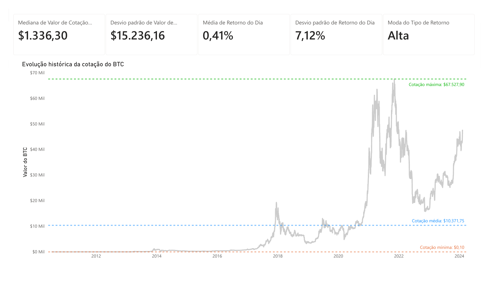

# Dashboard Histórico do Bitcoin | Power BI

Projeto desenvolvido durante o curso técnico em Ciência de Dados com o objetivo de explorar o histórico de cotações do Bitcoin e transformar os dados em uma visualização analítica no Power BI.



## Sobre o projeto

O conjunto de dados utilizado possui **4.955 registros históricos**, cobrindo o período de **2010 a 2024**. A base reúne informações de abertura, máxima, mínima e fechamento da cotação, além de volume e retorno diário.

O dashboard foi desenvolvido para facilitar a leitura da evolução histórica do ativo e reunir indicadores estatísticos em uma única visualização.

## Principais análises

- Evolução histórica da cotação do Bitcoin
- Cotação mínima, média e máxima
- Mediana dos valores de cotação
- Desvio padrão dos valores de cotação
- Média do retorno diário
- Desvio padrão do retorno diário
- Moda do tipo de retorno

## Dados

O arquivo `analytics_historic_bitcoin.csv` possui 9 colunas:

- Volume em Circulação
- Valor de Cotação (Abertura)
- Valor de Cotação (Máxima)
- Valor de Cotação (Mínima)
- Retorno do Dia
- Dia da Cotação
- Mês da Cotação
- Ano da Cotação
- Valor de Cotação (Fechamento)

> O CSV utiliza `;` como separador e vírgula como separador decimal.

## Ferramentas e conceitos utilizados

- Power BI
- Power Query
- Preparação e transformação de dados
- Análise exploratória de dados
- Visualização de séries temporais
- Estatística descritiva

## Como visualizar

- `assets/dashboard_preview.png` — preview do dashboard
- `dashboard_historical_BTC.pdf` — versão exportada para visualização rápida
- `dashboard_historical_BTC.pbix` — arquivo original do Power BI
- `analytics_historic_bitcoin.csv` — base de dados utilizada no projeto

## Estrutura do repositório

```text
bitcoin-historical-dashboard/
├── analytics_historic_bitcoin.csv
├── dashboard_historical_BTC.pbix
├── dashboard_historical_BTC.pdf
├── assets/
│   └── dashboard_preview.png
└── README.md
```

## Aprendizados

Este projeto foi desenvolvido como atividade prática do curso técnico e serviu para exercitar a transformação de uma base histórica em informações visuais, a escolha de métricas, a construção de indicadores e a organização de um dashboard no Power BI.

Também permitiu aplicar conceitos de estatística descritiva em um conjunto de dados real, relacionando medidas como média, mediana e desvio padrão à interpretação da série histórica.

## Próximas melhorias

- Criar filtros por período
- Revisar a apresentação e nomenclatura de alguns indicadores
- Adicionar análises de volatilidade por período
- Comparar retornos em diferentes janelas de tempo
- Documentar de forma mais detalhada as transformações realizadas no Power Query
- Documentar a fonte original do conjunto de dados

> Projeto desenvolvido para fins educacionais e de análise de dados. Não representa recomendação de investimento.
